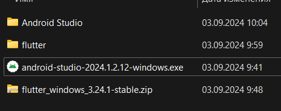
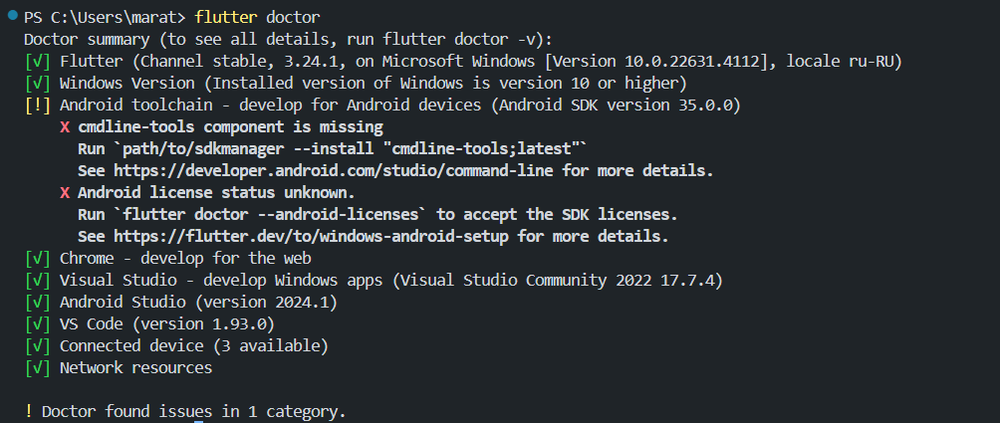
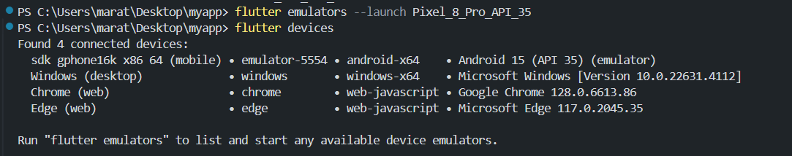
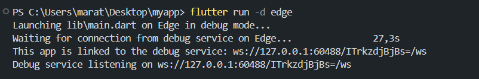
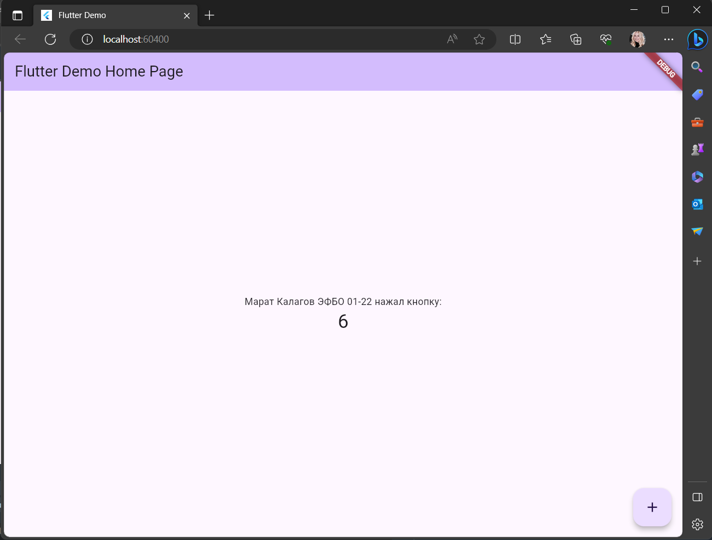
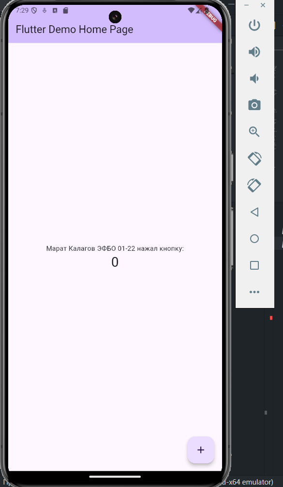

# Практическая работа №1 по Программированию корпоративных систем
## Калагов Марат Владимирович ЭФБО-01-22

### Установка всех компонентов
1. Установил Android Studio и Flutter SDK по инструкции на сайте Metanit

2. Добавил в переменную среды Path путь C:/flutter/bin

3. В терминале ввел команду  `flutter doctor` и проверил, что все компоненты были установлены корректно

### Создание нового проекта

1. С помощью команды `flutter create` создал новый проект Flutter (к сожалению не делал скриншотов на этом этапе)

2. Далее с помощью команд `flutter devices` и `flutter emulators` проверил, с помощью каких устройств можно запустить приложение

3. Открыла проект в Android Studio, предварительно установив плагины Dart и Flutter. В файле main.dart нашла кусок кода, который нужно изменить

### Запуск приложения

1. С помощью команды `flutter run -d edge` запустил приложение в Google Chrome

2. С помощью команды `flutter emulators -–launch` запустил эмулятор, далее подключился к нему по id с помощью команды `flutter run –d emulator-5554`

